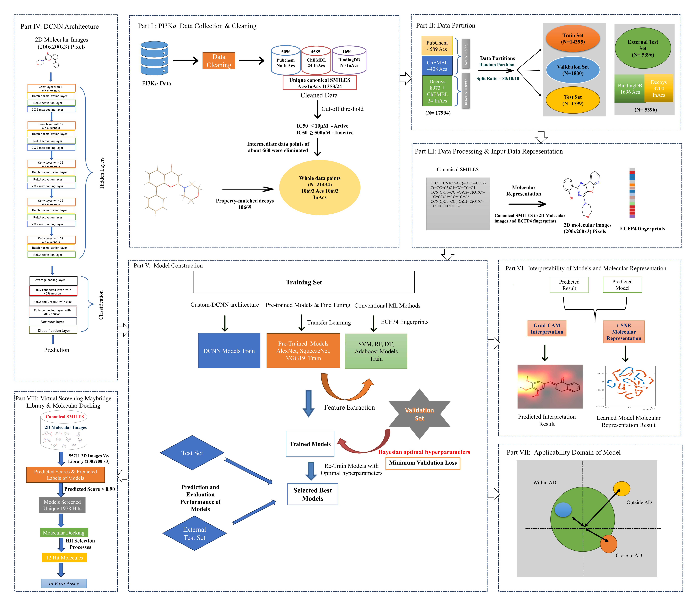

# iDCNNPred: An interpretable deep convolutional neural network prediction system-based virtual screening and identification of potential inhibitors of PI3Ka isoform against triple-negative breast cancer

* iDCNNPred is a PI3Ka prediction system, for an early stage of small molecules identification, using deep convolutional neural networks
* Advantages of iDCNNPred system employing easily available 2D structural representation of molecules as an input instead of conventional fingerprints, which perform better than conventional fingerprint's limited performance
* iDCNNPred system learns complex features from the 2D representation of molecules, which produces a highly accurate prediction
* More details can be obtained from the iDCNNPred journal article 

## iDCNNPred system workflow overview

## Descriptions of directory and files 
* **Script** directory includes Custom-DCNN and Pre-trained codes of the iDCNNPred system
* **Data** directory includes training, validation, testing, external test set, and virtual screening of Maybridge’s chemical library:
    **Data/Custom_DCNN__dataset.mat** file includes the training, validation, testing and external test sets

    **Data/AlexNet_dataset.mat**, **Data/SqueezeNet_dataset.mat**, and **Data/VGG19_dataset.mat** files includes the pre-trained networks training,validation, testing, and external test sets
    
    **Data/Maybridge_VS.mat** file include the virtual screening of Maybridge dataset

* **Molecular_Representation** directory includes the script and sample dataset for Conversion of valid canonical SMILES strings of molecules into 2D molecular images:
    **Molecular_Representation/Image_Processing_Small_Molecules.ipynb** A Python script file to convert SMILES strings to 2D molecular image for deep convolutional neural networks 

    **Molecular_Representation/sample.csv** sample csv file of SMILES with molecule IDs

* **Model** directory include file of optimized best trained model 
    **the Custom_DCNN and Pre_trained fine-tuned final models run results can be obtain from data repository given in link paper**

* **Consensus_hits** directory include the **Consensus_hits/Consensus_hits.sdf** file of all best performed model predicted and selected consensus (unique) molecules from unlabeled Maybridge chemical library

* **12_hit_molecules** directory include the **12_hit_molecules/12_hit_molecules.zip** zip file of final 12 hit molecules against PI3Ka obatined after multi-step screening approaches

* **21_Standard_inhibitors** directory include the **21_Standard_inhibitors/21_standard_inhibitors.sdf** file of 21 standard inhibitors for comparative analysis with predicted 12 hit molecules

# Bayesian Hyperparameter optimization
how to train the iDCNNPred models and obtain optimal parameter sets:

* First clone Git repository and download the compressed zipped file
* Direct to your project working directory and unzip compressed file and locate dataset under **Data/Custom_DCNN__dataset.mat** load in MATLAB workplace:  **imdsTrain** and **imdsValidation** sets used to train the Bayesian hyperparameter optimization to obtain least validation error or loss 

* The **Script/Custom_DCNN/makeObjFcn.m** is training network architecture and **Script/Custom_DCNN/Bayesian_optimization.m** hyperparameter sets optimized during train the model

* Run the **Script/Custom_DCNN/Bayesian_optimization.m** code to get best optimal parameter sets of trained model

# Train new model with best optimal parameter sets obtained from optimized model

* Run the **Script/Custom_DCNN/Retrain_optimized_hyperparameters.m** code to get final model with different training option settings

# Prediction of best performing model
* Run the  **Script/Custom_DCNN/Prediction_performance.m** code to obtain the results of predicted label and probability score in form of csv file

# Pre-trained models fine-tuning
* Pre-trained models such as AlexNet, SqueezeNet, and VGG19 weights updated by unfreeze some layers to fine-tuning with our dataset
* First change the input image size with respect networks requires input sizes (e.g. AlexNet:227 x 227, SqueezeNet:227 x 227, and VGG19:224 x 224)
* Change the last few layers of networks, for example AlexNet fully connected layer, a softmax layer, and a classification output layer; SqueezNet classification output layer,and freeze initial layers; VGG19 similar changes to SqueezeNet

* Run main code **Script/Pre_Trained/bayes_opt_AlexNet.m** , **Script/Pre_Trained/bayes_opt_SqueezeNet.m**, and **Script/Pre_Trained/bayes_opt_VGG19.m** to obtain optimized fine-tuned models

# Grad-CAM visualization of prediction by model
* To interpret how and why some prediction are positive or negative,we visualized by using the technique Gradient-weighted class activation mapping (Grad-CAM) by run the code **Script/Custom_DCNN/Grad_CAM_Visualization.m**

# Molecular representation of learned features by t-SNE visualization
* To analyse and visualize the different hierarchical level features learned from the model by using early max-pooling, convolutional, and final softmax layer. Get the result when run the code  **Script/Custom_DCNN/t_SNE_Visualization.m**

# Applicability domain (AD) of model
* To check the reliability and generalizability of model, we used Applicability domain (AD) analysis to analyze the unseen predicted data points are outside or inside AD. Get the result and plot when run the code **Script/Custom_DCNN/Applicability_domain.m**
